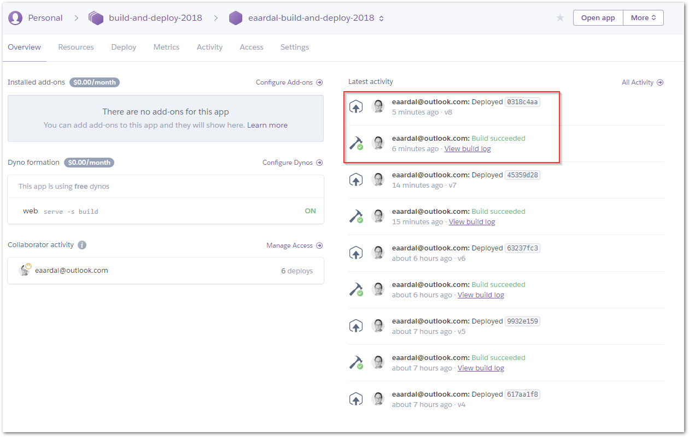

# Exercise 4 - Deploying the app using Heroku

These days there is a plethora of services to choose from when it comes to hosting code on the internet, from Amazon Web Services (AWS), Windows Azure, Google Cloud, and many, many more.

We're going to use Heroku today, because TravisCI and Heroku integrate nicely with eachother with minimal configuration and complexity.

## Registering

:pencil2: Head over to [Heroku and register](https://www.heroku.com/).

## Create a project

> If you have done this Nerdschool workshop before and already have a Heroku project for this, either delete it or create a new one with a slightly different name, for example `build-and-deploy-2018`.

:pencil2: On your dashboard, create a new app.


:pencil2: Give it a name (for example `YOURNAME-build-and-deploy`).  
:pencil2: Choose `Europe` as the region.  
:pencil2: Add a _pipeline_. A pipeline is a build pipeline which our deployment will belong to. This workshop will only utilize one pipeline, but a bigger project might consist of many apps that needs to be deployed individually.  
:pencil2: Name the pipeline something similar to what you named the project.  
:pencil2: Choose `production` as the stage/environment.

## Connecting TravisCI and Heroku

Once your project has been created in Heroku you'll see many options of deploying your app to Heroku. Instead of using any of those options, however, we're going to configure TravisCI to notify Heroku to deploy our app once Travis has successfully built our app.

### Encrypting the API key

The first obstacle is that Travis expects us to use an encrypted version of the Heroku API key which will authorize the two APIs to talk to eachother. To do this we must install TravisCI commandline tool on our machine and use this to encrypt the key.

Unfortunately, the TravisCI CLI tool is not a standalone app, but a Ruby gem, which means we need Ruby installed to get this to work. If you already have Ruby installed, great, but check in the Travis CI install instructions that your version is sufficient.

:pencil2: Follow the install instructions [here](https://github.com/travis-ci/travis.rb#installation) to install Ruby and the Travis CLI tool on your OS.  
:pencil2: Once you have Ruby and the Travis CLI tool installed and available on your terminal, head over to your [Account Settings](https://dashboard.heroku.com/account) page on Heroku and scroll down to `API Key`. Generate a new one or `Reveal` your existing one if any. Copy it.  
:pencil2: Make sure your terminal is in the repository root directory (in the same dir as the travis.yml file) then run `travis encrypt YOUR_HEROKU_KEY --add deploy.api_key`.  
:pencil2: Open `.travis.yml`. The script should've added a `deploy` section with an encrypted key:

```yml
deploy:
  api_key:
    secure: ah4aKbX7LRA8Av1x...
```

## Deploy config

### TravisCI

:pencil2: We also need to tell Travis that we're deploying to Heroku. Add `provider: heroku` to the `deploy` section.  
:pencil2: We must also tell Travis what Heroku app we want to deploy. Add `app: YOUR_HEROKU_APP_NAME`.  
:pencil2: Lastly, we need to add `skip_cleanup: true` to tell Travis to leave our `build` folder alone when cleaning up after running the CI steps. We need this folder to be copied to Heroku and by default Travis will remove it.

```yml
deploy:
  skip_cleanup: true
```

**Example of complete `.travis.yml` file at this point:**

```yml
language: node_js
node_js:
- '8'
cache:
  directories:
  - node_modules
script:
- npm run lint
- npm test
- npm run build
deploy:
  provider: heroku
  app: eaardal-build-and-deploy-2018
  skip_cleanup: true
  api_key:
    secure: ah4aKbX7LRA8Av1x...
```

### Heroku

Heroku must also be told what to do with our app, and this is also done through a config file named `Procfile`.

:pencil2: Create a new file named `Procfile` in the root of your repository.  
:pencil2: It should just contain a single line: `web: serve -s build`. This will start the `serve` app from our `build` folder.

## Deploying

:pencil2: Time to test the whole pipeline! Git commit and push all your changes. Then jump over to Travis and see that the build succeeds, and that the build log indicates that it's deploying to Heroku.  
:pencil2: Open your Heroku project and see that the deploy succeeded.



:pencil2: Finally, click the `Open app` button to browse your newly deployed app! :tada: :sparkles:


If you've come this far, congratulations! The main parts regarding build and deploy is now done, but exercise 5 has some bonus tasks to build on the app and deploy it rapidly. After all that work of setting up a deployment we need to use it!

### [Go to exercise 5 :arrow_right:](./exercise_5.md)
