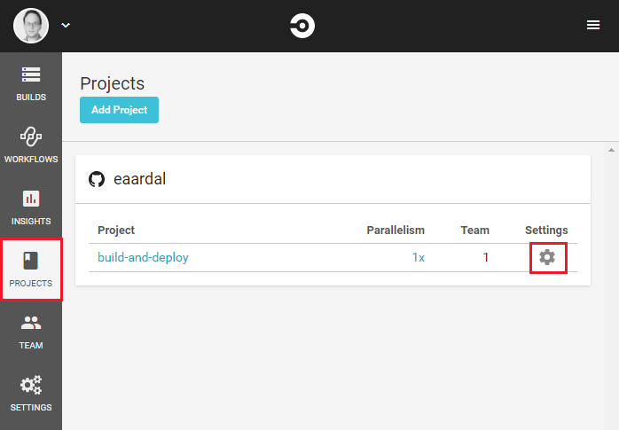
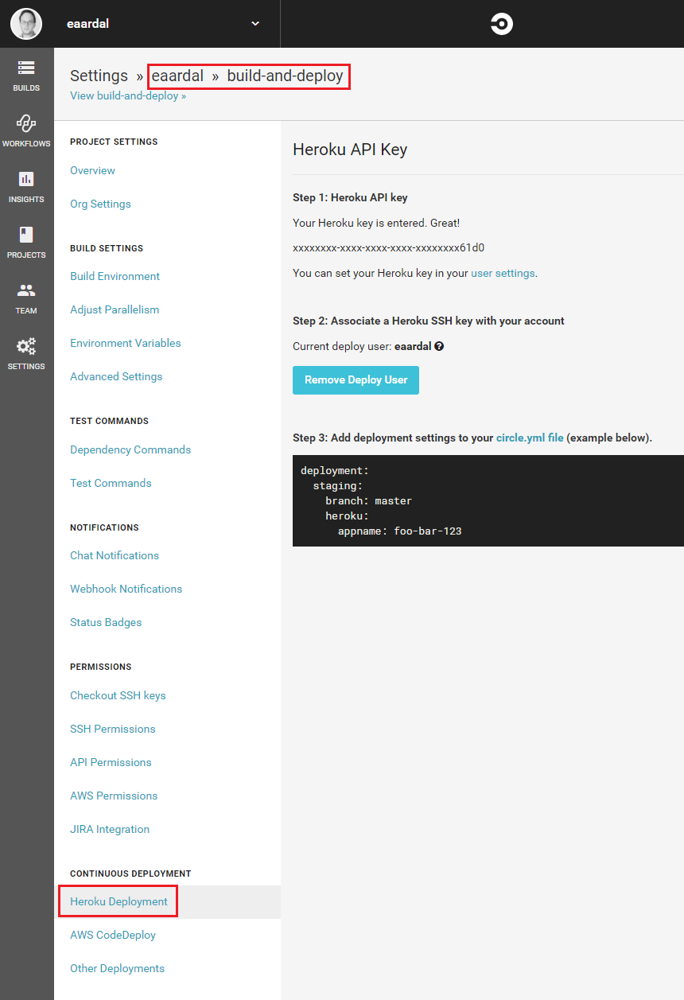

# Exercise 5 - Continuous Deployment

So we verified our code is building and tests are passing. We are halfway there! Now we just need a web server to serve and host our app.

> :book: _Continuous deployment_ is the process of automatically deploying our changes to a web server after a successful build.

> :book: A web server is something receiving a request on a port on a machine and responds by running our code in a process on the machine. Typical web servers include Apache, Internet Information Services (IIS) and NodeJS.

We currently launch a _local_ web server using our command `grunt startlocal`. Our web server is called _[connect](https://github.com/senchalabs/connect)_, which is a _middleware_ on top of NodeJS (but don't worry about that now).

We also have a configuration for running our application on _a server_.

:pencil2: Try running `grunt connect:server`.

You will see in console that it started a web server on http://0.0.0.0:9601, but no browser opened automatically.

:pencil2: Try to open [http://localhost:9601/](http://localhost:9601/) and see that our app is currently running.

:pencil2: Open Gruntfile.js and locate the `connectConfig` object. Notice that the port is assigned as `process.env.PORT || 9601`. This means that if the `PORT` _environment variable_ is present, use that value. Otherwise default to port 9601.

In many environments the PORT environment variable is used by convention. One of those environments is _Heroku_ which will launch the server listening to a port _provided by Heroku_ instead of 9601.

Heroku is a cloud solution offering containers (Heroku calls them _Dynos_) where we can run our application and make it available on the internet. As mentioned, Heroku assigns a port to serve our application on, so we don't have to worry about that.

We want to deploy to this container every time our application builds. In other words, every time CircleCI finishes a successful build, we want Heroku to receive that build and host it in a Dyno/container. The workflow will be that CircleCI _pushes_ the successful build to Heroku.

Let's start by creating a Heroku account.

## 5.1 - Heroku account

:pencil2: Go to [https://www.heroku.com/](https://www.heroku.com/) and click the sign up button.  
:pencil2: Enter your information and select Node.js as your development language.  
:pencil2: We need a new app. In the top right corner of the dashboard there is a _New_-button, click it and select _Create new app_. Give it an easy to remember name which has not been used, like `{your-name}-build-and-deploy`, and select `Europe` as your `Runtime Selection`.

Now we must connect our CircleCI account to Heroku so CircleCI knows where to push its successful builds.

## 5.2 - Connecting Heroku to CircleCI

:pencil2: In CircleCI, go to your project (build-and-deploy) and click the _Project Settings_ cogwheel icon.



Luckily for us _Heroku Deployment_ is an option in the menu.



Here we see that we are prompted for the Heroku API Key.

:pencil2: Open the blue link for the Heroku API Key in a new browser tab and scroll to bottom.  
:pencil2: There is an option here to show the api key, click it and copy the key into CircleCI.  
:pencil2: After you click save, further click the set user to your user button.  

Almost done now.

CircleCI also require us to set up the name of the Heroku application to deploy the build to.

Open the `circle.yml` file and add the deployment configuration at the bottom of the file.

```diff
dependencies:
 override:
   - npm install
   - bower install
 post:
   - grunt build

test:
 override:
   - npm test

+ deployment:
+ prod:
+   branch: master
+   heroku:
+     appname: {your-heroku-app-name}
```

We now have a _deployment configuration_ which deploys to the _prod_ environment using the _master_ branch in our Git repository, and deploys to the Heroku app you specified.

:pencil2: Commit and push the change. Inspect the build result in CircleCI.

The build should succeed.

:pencil2: Let's try and access our web page at `https://{your-app-name}.herokuapp.com/`.  

You should now see the glorious calculator app live and running! :tada: :sparkles:

But wait. While the application is live, it's not working as intended just yet.

:pencil2: Open the developer console in your web browser (<kbd>F12</kbd>). You should see an error in the `Console`-pane.

It complains that angular is _not defined_, and if we further look at sources, `style.min.css` does not contain the content from bootstrap. If you are good at reading minified files you'll also notice that not only is angular missing, jQuery and bootstrap isn't there either.

## 5.3 - `Procfile`
Everything we're missing has a common trait: They're all dependencies we install using Bower.

To start our investigation, let's start with understanding how Heroku knows _how to run our web server_.

:pencil2: Open the Procfile from project root directory.  

The `Procfile` is the file Heroku reads when it's about to start the application. It contains instructions for how to start and run our app.

We see that it's doing something using the `web` keyword and assigns it the `grunt start` command.

:pencil2: Open the `Gruntfile.js` and find the `start`-task (line 109). We see that running the `start`-task should `build` and then `connect:server`. This should be sufficient, yes?

Well, if you'll remember, in exercise 4.2 you deleted the `"scripts"`-section in `package.json`. The deleted section looked like this:

```json
"scripts": {
  "postinstall": "bower install && grunt build",
  "test": "grunt test"
},
```

We currently do the `grunt build`-part of the `"postinstall"` script (through the Procfile), but we're not doing the `bower install` part yet.

So let's re-introduce this step:

```json
"scripts": {
  "postinstall": "bower install"
},
```

This instructs npm to run `bower install` after `npm install` has finished.
