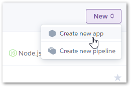

# Exercise 4 - Deploying the app using Heroku

These days there is a plethora of services to choose from when it comes to hosting code on the internet, from Amazon Web Services (AWS), Windows Azure, Google Cloud, and many, many more.

We're going to use Heroku today, because TravisCI and Heroku integrate nicely with eachother with minimal configuration and complexity.

## Registering

:pencil2: Head over to [Heroku and register](https://www.heroku.com/).

## Create a project

:pencil2: On your dashboard, create a new app.



:pencil2: Give it a name (for example `YOURNAME-build-and-deploy`).  
:pencil2: Choose `Europe` as the region.

Ignore the `Add to pipeline` option.

:pencil2: Click `Create app`.

## Connecting TravisCI and Heroku

Once your project has been created in Heroku you'll see many options of deploying your app to Heroku. Instead of using any of those options, however, we're going to configure TravisCI to notify Heroku to deploy our app once Travis has successfully built our app.

### Encrypting the API key

The first obstacle is that Travis expects us to use an encrypted version of the Heroku API key which will authorize the two APIs to talk to eachother. To do this we must install TravisCI commandline tool on our machine.

Unfortunately, the TravisCI CLI tool is just a Ruby gem which means we need Ruby installed to get this to work.

:pencil2: Follow the install instructions [here](https://github.com/travis-ci/travis.rb#installation) to install the Travis CLI tool on your OS.  
:pencil2: Once you have Ruby and the Travis CLI tool installed and available on your terminal, head over to your [Account Settings](https://dashboard.heroku.com/account) page and scroll down to `API Key`. Generate a new one or `Reveal` your existing one if any. Copy it.  
:pencil2: In your terminal run `travis encrypt YOUR_HEROKU_KEY --add deploy.api_key`.  
:pencil2: Open `.travis.yml`. The script should've added a `deploy` section with an encrypted key:

```yml
deploy:
  api_key:
    secure: ah4aKbX7LRA8Av1x...
```

:pencil2: We also need to tell Travis that we're deploying to Heroku. Add `provider: heroku` to the `deploy` section.  
:pencil2: We must also tell Travis what Heroku app we want to deploy. Add `app: YOUR_HEROKU_APP_NAME`.

Example of `.travis.yml` at this point:

```yml
deploy:
  provider: heroku
  app: eaardal-build-and-deploy-2018
  api_key:
    secure: ah4aKbX7LRA8Av1x...
```
